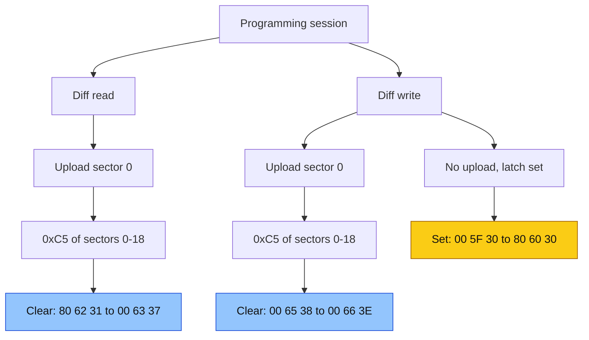
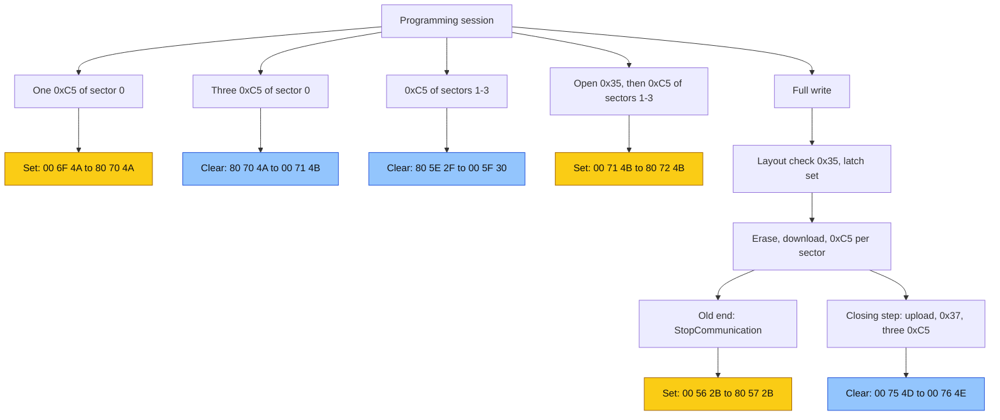
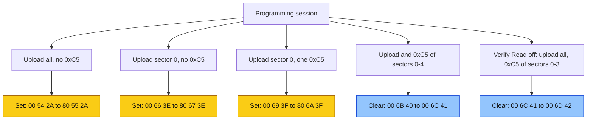

# P1681 and P0602

These are the bench measurements for [issue #5](https://github.com/NefMoto/NefMotoOpenSource/issues/5) on an A-chassis ME7.5 `4B0906018CH`. A late B-chassis `018D*` is a different ECU, and that case is in the `DQ` section below.

What to do when `P0602` is set is in [P0602](user-guide/clearing-P0602.md). Connect, cable, and the RAM kernel after a KWP write are in [KWP2000.md](KWP2000.md).

The runs below used direct K-line on the bench. The 95040 stayed the saved `CH` chip for every image. DTC reads are after a key cycle, outside the programming session.

## Sectors

On `29F800BB` a sector is a layout sector. Numbering matches the layout file. Sector 0 is the 16 KB sector at `0x800000`. The boot cluster is sectors 0–3. An older note uses block 1 for sector 0 and block 4 for sector 3.

| Sector | Size | Range |
| --- | --- | --- |
| 0 | 16 KB | `0x800000`–`0x803FFF` |
| 1 | 8 KB | `0x804000`–`0x805FFF` |
| 2 | 8 KB | `0x806000`–`0x807FFF` |
| 3 | 32 KB | `0x808000`–`0x80FFFF` |
| 4–18 | 64 KB | `0x810000`–`0x8FFFFF` |

The descriptor entries at file `0x1FBFE` are a separate list from these layout sectors (see [Descriptors](#descriptors)).

## Kernel logic

This section is from a disassembly of the `06A906032NL` RAM kernel. The kernel is copied from flash to RAM at `0x380000`, and RAM `0x38xxxx` is file offset `xxxx + 0x5DE6`. The bench counters below fit it, and bench runs confirmed the login set, the three-match clear, and the upload latch ([Clearing](#clearing)). The kernel runs from the image on the ECU when the session starts.

Other images carry the same kernel:

| Image | Kernel vs `NL` | Upload latch | Streak | Byte 8 | State byte | Flash sum |
| --- | --- | --- | --- | --- | --- | --- |
| `06A906032NL` | — | `0x381B30` | `0x381BB1` | `0x381BA4` | `0xE2BC` | `0x0097CF02`, matches |
| `4B0906018CH` | handlers and flash sum byte-identical, same offsets | same | same | same | same | `0x00A59DAB`, matches |
| `4Z7907551S` | same instructions, code 10 bytes lower, RAM moved | `0x381B32` | `0x381BB5` | `0x381BA8` | `0xE2BA` | `0x0092634D`, matches |
| `4B0906018DQ` | same instructions, code 2 bytes lower, RAM moved | `0x381B32` | `0x381BB5` | `0x381BA8` | `0xE2BA` | `0x007CD488`, matches |

In `CH` the only differences in the kernel region are the boot descriptor values at `0x808000` and a few words near `0x80DB00` and `0x80DDC6`. `4Z7907551S` and `4B0906018DQ` match `NL` instruction for instruction in the `0x31`, `33 C5`, `0x35`, `0x27`, and `0x37` handlers once addresses are masked. Their flash sum is reached through a jump at `0x8002FC` and has the same checks. All four write pages 30 and 31 (`0x1E0`, `0x1F0`) and use the same boot descriptor layout. `4Z7907551AA` has the same offsets as `4Z7907551S`.

Page bytes 8, 9, and 10 are the flag byte, the first counter, and the second counter. The kernel keeps them in RAM at `0x381BA4`–`0x381BA6` and writes both pages with `0x3869A6`. That writer reads pages 30 and 31 into `0x381B7E` and `0x381B8E`, builds six bytes (`0x381BA4`, `0x381BA5`, `0x381BA6`, `0x381BB0`, `00`, `00`), and calls `0x38651C` with offset 8 and length 6 for each page. `0x38651C` copies them to page bytes 8–13 and adjusts the checksum word at byte 14 by the difference. So every kernel page write also stores byte 11 from `0x381BB0` and zeroes bytes 12–13.

- **Login sets the flag.** The `0x27` handler is `0x385176` (file `0xAF5C`). A correct key sets bit 7 of byte 8, advances byte 9, and writes both pages. A seed request at level 3 (`27 03`) sets `0x381B2C`, and the key then skips that step for the rest of the session. This tool asks for seed `0x01`.
- **Three matching checksums clear it.** `33 C5` is `0x3846B6` (file `0xA49C`). While the routine runs it answers `7F 33 23`. A match answers `73 C5 00` and adds one to a streak at `0x381BB1`. A mismatch answers `7F 33 77` and resets the streak. On the third match the streak resets and the kernel runs its flash sum `0x805F4A`. If that passes, byte 8 is zeroed, byte 10 advances, and both pages are written.
- **The flash sum ignores the tester's range.** It adds the first and last word of every 8 KB block in `0x800000`–`0x80FFFF` and `0x820000`–`0x8FFFFF`. It compares that with the value the boot descriptor at `0x808000` points to, and checks the words at `0x810000` and `0x81FFFE` against `0x81BEBA`. On unpatched `NL` the sum is `0x0097CF02` and matches.
- **An open upload stops the count.** The `0x35` handler (file `0xA77E`) sets `0x381B30` to 1 once the addresses and login pass, before the upload starts. Only `0x385D42`, a finished upload followed by a successful `0x37`, sets it back to 0. While it is 1, `33 C5` results are neither counted nor reset.
- **This tool leaves that latch set.** `ValidateStartAndEndAddressesWithRequestUploadDownloadAction` runs first in every KWP read and write. It sends `0x35` probes and never sends TransferData or `0x37`. A diff read or a full read uploads a sector and exits, which clears the latch. A write downloads only, so both writes now end with a 2-byte upload and exit (see [Clearing](#clearing)).
- **The tool code is not checked.** `0x3844EE` (file `0xA2D4`) rejects six zero bytes in `31 C4` with `7F 31 33`. Accepted or not, `0x38691C` then writes the six bytes to page bytes 2–7. Nothing compares them with a stored value.
- **The checksum worker** is `0x386170`. A range that fails its bounds check counts as a mismatch. The match and mismatch paths also set and clear bit 1 of byte 8 in RAM, so a stored byte 8 of `0x02` means the last checksum before a page write was a mismatch.

The counters fit this. Byte 9 advanced once per session that logged in. Byte 10 advanced once per three counted matches:

| Run | Counted matches | Byte 10 |
| --- | --- | --- |
| Diff read, sector 0 uploaded, then 19 checksums | 19 | `31` to `37` |
| Diff write, sector 0 uploaded, then 19 checksums | 19 | `38` to `3E` |
| Same diff write with the closing step: 19 checksums, then 3 more | 22 | `4E` to `55` |
| Upload and checksum sectors 0–4 | 5 | `40` to `41` |
| Checksum sectors 0–3, upload the rest | 4 | `41` to `42` |
| Sectors 1, 2, and 3 | 3 | `2C` to `2D`, `2F` to `30` |
| Sectors 1–18, in-session read | 18 | `22` to `28` |
| Diff write, no upload, every sector skipped | 0, latch set | `30` to `30` |
| Full write before the closing step | 0, latch set | `2B` to `2B`, `2C` to `2C` |
| Full write with the closing step | 3 | `4D` to `4E` |
| Diff write, every sector skipped, closing step | 3 | `69` to `6A` |
| Read of sectors 0–3, cancelled, closing step | 4 + 3 | `67` to `69` |
| Full read, **Verify Read** checked | 19 | `6B` to `71` |

Two runs do not fit. One full write before the closing step went from `00 5C 2E` to `00 5D 2F`, one login and one clear, with the latch expected to be set. It stored `01 00 00 00 00 00` as the tool code, which the kernel does not read, and a rerun ended set. The diff write with sectors 1, 2, and 3 last went from `80 60 30` to `80 62 31`, which is two logins, so it was probably two sessions.

## Current behavior

On an ME7.5 `4B0906018CH`, bit 7 of page byte 8 on 95040 pages 30 and 31 is the EEPROM bit. That byte follows the six-byte tool-code field. On a KWP layout whose sector 0 is 16 KB at `0x800000`:

- **Diff Read Flash** uploads sector 0, checksums it, then checksums sectors 1–18. That read cleared the EEPROM bit, from `80 62 31` to `00 63 37`.
- **Diff Write Flash** checksums each sector, writes the ones that differ, then ends with the same closing step as a full write. With every sector skipped the page went from `00 7C 69` to `00 7D 6A`. Earlier versions measured:
  - No upload and no closing step: every checksum ran with the latch set, and the bit ended set (`00 5F 30` to `80 60 30`).
  - Sector 0 uploaded before its checksum: `00 65 38` to `00 66 3E`.
  - Sector 0 upload plus the closing step, every sector skipped: `00 76 4E` to `00 77 55`.
- **Full Read Flash** uploads every sector and saves the image. **Verify Read** is checked, so every sector is checksummed after its upload. Unchecked, the read checksums sectors 0, 1, 2, and 3 and uploads the rest with no checksum. On that unchecked run the page stayed `00 6C 41` to `00 6D 42`. Checked, all 19 sectors matched and the page went from `00 7E 6B` to `00 7F 71`: one login and six clears. A bootmode read sends no `0xC5`. A read on a layout whose sector 0 is some other size or address also sends no `0xC5`.
- **Full Write Flash**, after the last sector, uploads 2 bytes at the start of flash (`0x800000`), exits, and checksums the first finished sector three times. That write went from `00 75 4D` to `00 76 4E`. Before the closing step, the same write left the EEPROM bit set (`00 56 2B` to `80 57 2B`, and `00 58 2C` to `80 59 2C`).
- **Check if Flash Matches** (debug) logs in and checksums each sector of the loaded file, with no upload. Three matching sectors in a row clear the EEPROM bit. With a matching `NL` file all 19 sectors matched and the page went from `00 78 56` to `00 79 5C`: one login and six clears.
- A read that fails after at least one sector finished ends with the same closing step as a full write, using the first sector that finished. **Cancel Current Operation** waits for the current request and then does the same; a second cancel stops at once. A read cancelled during sector 3 went from `00 7B 67` to `00 7C 69`. A read that fails before any sector finished, and a write that stops partway, end with the EEPROM bit set.

## What sets the flag

A correct SecurityAccess key in the programming session sets byte 8 to `0x80`. These runs logged in and then did not get three counted matches, so they ended at `0x80`:

- A checksum of sector 0 alone, with no upload and no erase
- An upload of sector 0 with no checksum after it
- An upload of sector 0 followed only by that sector's checksum
- A full read that uploads every sector and sends no checksum
- A full write before the closing step
- A diff write with no upload and no closing step

A key cycle while the flag is set stores `P0602` on unpatched `NL`.

## Regression checklist

In the log, a set shows up as `1A 9C` byte 0 changing to `0x80` while only the first counter moves.

- Every session that logs in has to end with three matching checksums in a row after its last upload and exit. Keep the write closing step.
- Any pair of sectors 1, 2, and 3 leaves the bit set, because that is two matches.
- On an image that contains the signature, keep every `0xC5` call. These `4B0906018CH` measurements describe this ECU.

## Clearing

A matching checksum of sectors 1, 2, and 3, as the whole session, clears the EEPROM bit. Under the kernel logic, the ranges do not matter: the third match in a row, with no open upload and intact flash, clears it. The same three calls cleared a set bit on every run (for example `80 59 2C` to `00 5A 2D`, and `80 5B 2D` to `00 5C 2E`). `XX XX` is the checksum of that sector in the loaded file.

```text
31 C5 80 40 00 80 5F FF XX XX
33 C5

31 C5 80 60 00 80 7F FF XX XX
33 C5

31 C5 80 80 00 80 FF FF XX XX
33 C5
```

On unpatched `NL` the three checksums are `63 1D`, `5C FC`, and `9C 14`. On `4B0906018CH` sectors 1 and 2 match `NL` and sector 3 is `E1 AD`. The third call clears the EEPROM bit because it is the third match. A third end of `0x80FBFF` also cleared the bit. The procedure keeps the end at `0x80FFFF`.

Sector 0 alone works the same way. On this `CH` with `NL`, each run below was one programming session with one granted login and no `0x35`. The `27` sent before the programming session starts gets `GeneralReject` and does not count. Page bytes 8, 9, and 10:

| Step | Bytes 8–10 |
| --- | --- |
| Start (`1A 9C`) | `00 6F 4A` |
| One checksum of `0x800000`–`0x803FFF` | `80 70 4A` |
| Three checksums of `0x800000`–`0x803FFF` | `00 71 4B` |

Login set the bit and advanced byte 9. One match left the bit set. Three matches cleared it and advanced byte 10.

An open upload blocks the clear. From `00 71 4B`, one session with one login, one accepted 2-byte `35` at `0x800000` (no transfer, no exit), and then sectors 1, 2, and 3 ended at `80 72 4B`. All three checksums answered as matches, and byte 10 did not move.

A full write of `NL` before the closing step went from `00 73 4C` to `80 74 4C`. Its layout check sent three `35` requests. The first, the whole range, was accepted and set the latch. The other two were rejected (`0x52`, then `0x53`). The kernel sets the latch only after the range checks pass, so rejected requests leave it alone. Every sector download ended with an accepted `37`, and only the upload exit clears the latch. Sectors 2 to 18 all matched after the erase-mode probe's mismatch, and none of them counted.

A full write now ends by closing that upload: a 2-byte `35` at `0x800000`, the transfer, and `37`. Then it sends three checksums of the first finished sector. A full write of `NL` went from `00 75 4D` to `00 76 4E`. The page was read between steps with `ReadMemoryByAddress` at `0x6001E0`, in a development session on a fresh connection.

**Clear DTCs** offers those three calls when the last read contained `P0602` or `P1681` and bit 7 is set. The loaded file has to match. Stock `CH` software never stores `P0602` from the bit, so there that offer does not appear. A debug build exposes **Checksum 8K+8K+32K** for the same three calls.

Reports of this DTC name the `4Z7` family most often, and `4Z7907551S` (the Allroad BEL) in particular. `4Z7907551S` stayed off this `4B0906018CH`. What sets the EEPROM bit on that ECU is unmeasured.

## Descriptors

At file offset `0x1FBFE`, `06A906032NL`, both `06A906032HN` files, and `4B0906018CH` have the same four 16-byte descriptors. Each entry is a little-endian start, end, value, and complement, and the value plus the complement is `0xFFFFFFFF`.

| Entry | Start | End |
| --- | --- | --- |
| 1 | `0x800000` | `0x803FFF` |
| 2 | `0x804000` | `0x807FFF` |
| 3 | `0x808000` | `0x80BFFF` |
| 4 | `0x80C000` | `0x80FBFF` |

Entries 1 and 2 are the same bytes on those four files, and sectors 0–2 are the same. Entries 3 and 4 differ, and sector 3 differs. The three clearing checksums cover entries 2 through 4. Layout sectors 1, 2, and 3 end at different addresses than those descriptor entries. Entry 2 is sectors 1 and 2 together. Entries 3 and 4 sit inside sector 3. Sector 3 also includes `0x80FC00`–`0x80FFFF`, past the end of entry 4. One `0xC5` of `0x800000`–`0x80FFFF` covers entries 2 through 4 and leaves the EEPROM bit set, because it is one match. The kernel's clear uses the boot descriptor at `0x808000`, not these entries.

## Flows

In the diagrams below, yellow marks a set EEPROM bit and blue marks a clear EEPROM bit. The diff write runs are from before writes ended with the closing step.

### Diff read and diff write



### Debug checksums and full write

Each branch is one session with one login. The debug checksums send no `0x35` unless noted. An open `0x35` is an accepted 2-byte upload request with no transfer or exit. In the full write, the layout check's accepted `35` leaves the latch set, so none of the sector checksums count. Only the closing step's checksums do.



### Full read tests

**Verify Read** starts checked and checksums every sector. That read went from `00 7E 6B` to `00 7F 71`. The no-checksum full read is the old product path.



## ASM patch

`06A906032NL` has one word-aligned hit of `DB 00 28 02 84 00 ?? ?? C2 F4 ?? ?? 66 F4 80 00 2D`, at file offset `0x7FCC8`. Byte `0x7FCD8` is the C166 instruction `2D` (`JMPR cc_Z`, jump if zero). The next byte, `0x7FCD9`, is the displacement `0D` (`+13` words). `4B0906018CH` has no hit of this pattern.

The patched image changes only that instruction to `0D` (`JMPR cc_UC`, jump always) and is checksum-corrected. The displacement byte stays `0D`. me7sum reports 0 errors.

The listing below is `NL` at those file offsets. `EXTP #0x00E1` makes `[0x0BB4]` RAM `0x384BB4`. Changing `2D` to `0D` takes the `#0x5A0F` path and skips the bit-field update. Both paths still reach the call.

```text
7FCD0  C2 F4 4C BC   MOVBZ R4, [0xBC4C]
7FCD4  66 F4 80 00   AND R4, #0x0080
7FCD8  2D 0D         JMPR cc_Z, 0x7FCF4
7FCDA  E6 F4 F0 A5   MOV R4, #0xA5F0
7FCDE  D7 40 E1 00   EXTP #0x00E1, #1
7FCE2  F6 F4 B4 0B   MOV [0x0BB4], R4
7FCE6  A8 50         MOV R5, [R0]
7FCE8  66 F5 FF F0   AND R5, #0xF0FF
7FCEC  76 F5 01 08   OR R5, #0x0801
7FCF0  B8 50         MOV [R0], R5
7FCF2  0D 06         JMPR cc_UC, 0x7FD00
7FCF4  E6 F4 0F 5A   MOV R4, #0x5A0F
7FCF8  D7 40 E1 00   EXTP #0x00E1, #1
7FCFC  F6 F4 B4 0B   MOV [0x0BB4], R4
7FD00  A8 40         MOV R4, [R0]
7FD02  76 F4 02 60   OR R4, #0x6002
7FD06  B8 40         MOV [R0], R4
7FD08  88 40         MOV [-R0], R4
7FD0A  E6 FC 35 00   MOV R12, #0x0035
7FD0E  DA 84 68 6D   CALLS 0x84, 0x6D68
```

A later function stores `#0x5A0F` to the same word. That function then reads the word back and compares it with `#0xA5F0`: a match sets `R8` to 1, and any other value sets `R8` to `0xFE`.

```text
7FD1E  E6 F5 0F 5A   MOV R5, #0x5A0F
7FD26  F6 F5 B4 0B   MOV [0x0BB4], R5
7FD30  F2 F4 B4 0B   MOV R4, [0x0BB4]
7FD34  46 F4 F0 A5   CMP R4, #0xA5F0
7FD38  3D 04         JMPR cc_NZ, 0x7FD42
7FD3A  E1 18         MOVB R8, #1
7FD42  E7 F8 FE 00   MOVB R8, #0xFE
```

The other images use the same instruction shape. The `NL` signature tests `[0xBC4C]`, which is the RAM copy of EEPROM offset `0x1E8` (see [Where byte 8 comes from](#where-byte-8-comes-from)). The listing names neither `P0602` nor `P1681`.

| Image | Hit | Displacement | Tested byte | Marker | `R12` | `CALLS` |
| --- | --- | --- | --- | --- | --- | --- |
| `06A906032NL` | `0x7FCC8` | `0D` | `0xBC4C` | `0x384BB4` | `#0x35` | `0x84:0x6D68` |
| `4B0906018DQ` | `0x7FC7E` | `0F` | `0xBBD0` | `0x385AFE` | `#0x32` | `0x85:0x0356` |
| `4Z7907551AA`, `4Z7907551S` | `0x6C0A6` | `0D` | `0xBEF0` | `0x384B12` | `#0x38` | `0x84:0x7A7C` |

On a `4B0906018CH` the `#0xA5F0` path came back as `P0602`, and forcing `#0x5A0F` left `P0602` clear. Whether that edit stops `P1681` on a late B-chassis ECU is unmeasured. `DQ` and the two `551` files stayed off this `4B0906018CH`. Older `06A906032` images `HN`, `HJ`, `HS`, and `FC` have no hit of this signature. [Topic 24553](https://nefariousmotorsports.com/forum/index.php?topic=24553.msg173155#msg173155).

## Where byte 8 comes from

The application EEPROM driver keeps a RAM mirror of the 95040. A 32-word page descriptor table gives each page its flags: bit 0 means checksummed (14 data bytes and a checksum word), bit 1 means mirrored, `0x80` means one half of a pair, and `0x40` means the backup half. The high byte is the mirror slot. A mirrored page lives at `mirror base + slot * 16`.

Page 30 has descriptor `0x..B7` (primary) and page 31 has `0x..F7` (backup, same slot). At boot the driver reads all 32 pages and checks each checksum. For each pair it copies the first valid copy into the mirror slot. Page 31 is used only when page 30 fails its checksum, and flash defaults are used when both fail.

| Image | Descriptor table | Mirror base | Page 30 slot | Byte 8 | Fault test |
| --- | --- | --- | --- | --- | --- |
| `06A906032NL` | `0x816E84` | `0x383AE4` | `0x16` | `0x383C4C` | `0x87FCCA`, path `0x35` |
| `4B0906018CH` | `0x8169F6` | `0x383B30` | `0x13` | `0x383C68` | none |
| `4Z7907551S` | `0x816E00` | `0x383DA8` | `0x14` | `0x383EF0` | `0x86C0A6`, path `0x38` |
| `4B0906018DQ` | `0x81715C` | `0x383A68` | `0x16` | `0x383BD0` | `0x87FC86`, path `0x32` |

EEPROM jobs go through a queue (`NL` `0x8A358C`, `DQ` `0x8C80CC`). Each job gives a page, offset, length, command, status, and buffer. Commands 0 to 2 read, 3 to 5 write and verify, and 6 to 8 work on the whole chip. The `NL` routine at `0x899252` queues only command 5 jobs. It writes pages back from the mirror, and it does not load them.

The `NL` boot loader is `0x8A3636`. Nothing calls it directly. It is an entry in two OS init process lists, at `0x812466` (which also holds the DTC table selector `0x84BB88`) and `0x812F62`. It walks the 32 descriptors at `0x816E84`, reads each page into `0xAA16` with three retries (`0x8A29B8`), checks the checksum (`0x8A2D30`), and copies the page into the mirror at `[0x704C]` + slot × 16. A pair whose copies both fail takes the flash default at `0x816EC6` + slot × 16.

All four images mirror page 30. `NL`, `S`, and `DQ` then test bit 7 of byte 8, set the `stateflp` marker to `0xA5F0`, and report their fault path. `CH` reads its byte 8 in two places, and neither is a fault test:

- `0x820276` is the tail of the boot init `0x820214`, not a function entry. It copies page 30 bytes 8–12 to RAM `0x380D59`–`0x380D5E`. `NL` has the same tail at the same address, reading `0xBC4C` into `0x8D7F`.
- `0x83B034` is the `1A 9C` (ReadEcuIdentification) handler `0x83AA0C`, called from `0x83A84C` when `[0xE1CA]` is 2 and answered with `7F 1A 10` otherwise. It replies `5A 9C`, then byte 8 with bit 3 forced from `[0xBB2E]`, then bytes 9 and 10. This is the `Flash status 1A 9C:` line the tool logs at connect.

`CH` also has no `0x1681` block. That is why stock `CH` software never stores `P0602` from this flag, while `NL` on the same hardware does.

## One path, two codes

An `8E0909518AL` A2L names the marker `stateflp_w`, "Status der Flashprogrammierung": `0xA5F0` means fault, and any other value means clear. That AL signature matches this `NL` listing. It tests `[0xBE6A]`, stores the marker at `0x384B3A`, and loads `R12` with `#0x31`. The A2L does not name the condition byte.

The same A2L names the codewords for the flash-programming path. `CDKFLP` is the customer code, four words of `0x0602`. `CDCFLP` is the CARB code, four words of `0x1681`. `NL` has those blocks: customer at file `0x139D4`, CARB at file `0x13534`. The words on either side match the AL layout the A2L describes.

The codes are two tables of four words per fault path, CARB first, then customer. A selector reads one calibration byte (`EXTP #0x206`) and stores the CARB base when it is 1 and the customer base otherwise. The codes for a path are at base + path × 8. The byte is `02` in all four images, so all four report the customer code.

| Image | Selector | Byte | Paths | CARB base | Customer base | Flag path codes |
| --- | --- | --- | --- | --- | --- | --- |
| `06A906032NL` | `0x84BB88` | `0x818483` | 148 | `0x81338C` | `0x81382C` | `0x35`: `0x1681` at `0x813534`, `0x0602` at `0x8139D4` |
| `4B0906018DQ` | `0x8631DC` | `0x8185E2` | 159 | `0x81C3D0` | `0x81C8C8` | `0x32`: `0x1681` at `0x81C560`, `0x0602` at `0x81CA58` |
| `4Z7907551S` | `0x84D04E` | `0x81850C` | 178 | `0x81C2FE` | `0x81C88E` | `0x38`: `0x1681` at `0x81C4BE`, `0x0602` at `0x81CA4E` |
| `4B0906018CH` | `0x849A58` | `0x8183F4` | 156 | `0x814254` | `0x814734` | none |

So `DQ` path `0x32` and `S` path `0x38` are the same fault as `NL` path `0x35`. `S` has a second `0x0602` entry, path `0xA7` with CARB `0x1640`, which is a different fault. `4B0906018CH` has one `0x0602` entry, path `0x40` with CARB `0x1612`, and no `0x1681` word anywhere. `CH` stays clear of `P0602` with the flag set, so that path does not follow byte 8. `CH` also has no copy of this signature.

This tool reads DTCs with service `0x18`, status `0x00`, group `0x0000` (`ReadDiagnosticTroubleCodesOperation`). On a `4B0906018CH` that read returned `0x0602` because the request asked for the customer code, so `18089` stays off that list.

## Session reads

The programming session rejects `ReadMemoryByAddress` at `0x6001E0`, and the same session rejects a switch to a development session. A fresh connection can start a development session and read `0x6001E0`. The in-session page was read in bootmode, before the application booted. Both copies matched. The DTC list for that page is read after a key cycle.

In-session pages after a clear, both copies, starting from `80 42 22` / `32 FD`:

- All 19 sectors, or sectors 1–18: `00 43 28 01` / `AA FD`
- Sectors 1, 2, and 3, from `80 42 22` / `32 FD`: `00 43 23 01` / `AF FD`

The repeat of sectors 1, 2, and 3, from `80 46 22` / `2E FD`, was not logged.

The byte that follows the counters is a different field from the EEPROM bit.

## Open

- A `27 03` login should leave the first counter and the bit unchanged, if the level-3 key is accepted.
- Why one full write before the closing step ended clear (`00 5C 2E` to `00 5D 2F`).

## `DQ` is a different ECU

`4B0906018DQ` is a late B-chassis ME7.5. A `4B0906018CH` is the older A-chassis ECU (`018CH`, `018CM`, `018CB`, and the same style from `01`–`05`; on a B6 or B5.5, `518F`/`518B` is that older style). An `018D*` in the B5.5 is the late hardware. Writing `018DQ` onto a `4B0906018CH` bricks KWP: one bootmode write left KWP silent and bootmode alive. Do not repeat that write.
