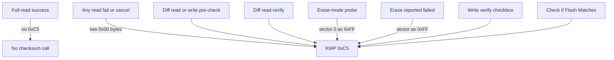

# P1681 and P0602

Bench note for [issue #5](https://github.com/NefMoto/NefMotoOpenSource/issues/5). This is one ECU, an A-chassis ME7.5 `4B0906018CH`. It is not a fix, and it does not describe a late B-chassis `018D*`.

Connect, cable, and the RAM kernel after a KWP write: [KWP2000.md](KWP2000.md).

**Scope:** Direct K-line on the bench. The 95040 stayed the saved `CH` chip for every image below. DTC reads are after a key cycle, outside the programming session.

---

## Result

Unpatched `06A906032NL` sets `P0602` (VAG `16986`, "Control Module Programming Error/Malfunction") after a bootmode write and after a finished KWP diff write. `4B0906018CH` software on the same 95040 does not. `18089`/`P1681` ("programming not finished") did not set.

The `2D` to `0D` edit in the one signature of that `NL` image left `P0602` clear after the same KWP diff write. Checksum errors are not required: `NL-bad-1` and the checksum-correct `NL` both set `P0602`.

| Image and step | `P0602` | `18089`/`P1681` |
| --- | --- | --- |
| `CH` flash, bootmode or KWP diff write | clear | clear |
| Unpatched `NL`, bootmode or KWP diff write, then key cycle | set | clear |
| Standard-session clear of that `P0602`, then key cycle | returns | clear |
| One `0xC5` (whole flash, sector 0 as `0xFF`, or two past-end zeros) while `P0602` is set | stays set | clear |
| Diff read of the file that matches the flash | clears, and stays clear on a later key cycle | clear |
| Patched `NL` (`2D` to `0D`), KWP diff write, then key cycle | clear | clear |

The post-patch DTC read still had the open-bench sensor codes. Ident after that write was `06A906032NL` level `0003`.

---

## The edit

`06A906032NL` has one word-aligned hit of `DB 00 28 02 84 00 ?? ?? C2 F4 ?? ?? 66 F4 80 00 2D`, at file offset `0x7FCC8`. Byte `0x7FCD8` is the C166 instruction `2D` (`JMPR cc_Z`, jump if zero). The next byte, `0x7FCD9`, is the displacement `0D` (`+13` words). `4B0906018CH` has no hit of this pattern.

The patched image changes only that instruction to `0D` (`JMPR cc_UC`, jump always) and is checksum-corrected. The displacement byte stays `0D`. me7sum reports 0 errors. Forcing the unconditional jump always takes the path that skips the bit-field updates on the other side of the test.

That function loads a byte, tests bit 7 (`AND #0x0080`), and stores `#0xA5F0` or `#0x5A0F`. `NL` tests `0xBC4C`. The same signature in `4B0906018DQ` is at file offset `0x7FC7E` (opcode `2D` at `0x7FC8E`, displacement `0F`) and tests `0xBBD0`. Neither copy stores the tester code. On this ECU the `#0xA5F0` path came back as `P0602`, and forcing the `#0x5A0F` path left it clear. `DQ` was not run, so its fault entry was not read.

That stopped `P0602` on this ECU. It does not say the same edit stops `P1681` on a late B-chassis ECU.

---

## What sends routine `0xC5`

`ValidateFlashChecksumAction` sends KWP routine `0xC5`: inclusive range, even start, odd end, low 16 bits of CRC-32 (polynomial `0xEDB88320`, init and final XOR `0xFFFFFFFF`). The ECU returns match or mismatch. Bootmode does not send this routine.

On this ECU, the three isolated calls (Check if Flash Matches, sector 0 as `0xFF`, past-end zeros) neither set `P0602` nor cleared it. A diff read whose file matches the flash did clear it. That session is an upload, a transfer exit, and a verify, and the flash bytes were not rewritten. Which of those messages cleared the stored code is unknown.

Do not change a `0xC5` call, and do not skip `0xC5` when the signature is present, based on this bench.

---

## `DQ` is a different ECU

`4B0906018DQ` is a late B-chassis ME7.5. This `CH` is the older A-chassis ECU (`018CH`, `018CM`, `018CB`, and the same style from `01`–`05`; on a B6 or B5.5, `518F`/`518B` is that older style). An `018D*` in the B5.5 is the late hardware. Writing `018DQ` onto this `018CH` bricks KWP: one bootmode write left KWP silent and bootmode alive. Do not repeat it.

This `CH` bench is closed. The remaining measurement is on late `018D*` hardware. `P1681` on that generation and `P0602` on this `CH` are separate findings. This bench does not establish how an `018D*` behaves.
