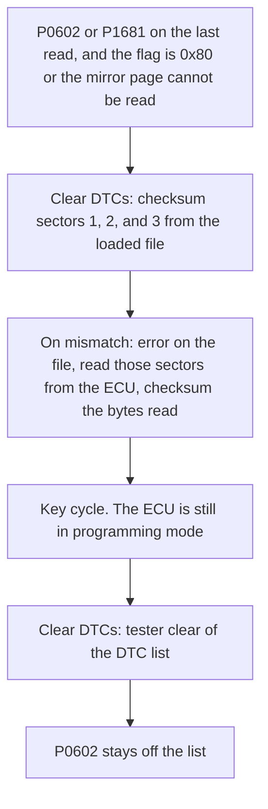

# P0602

`P1681` is the same fault. This tool reports it as `P0602`. Part numbers, pages, and the one-byte edit are in the bench note [P1681 and P0602](../P1681-P0602.md). That file keeps both names because `P1681` is the older name for this fault.

## The flag that brings P0602 back

`P0602` is the code on the DTC list. The flag is a separate byte in the ECU's EEPROM. **Read EEPROM Mirror** shows that byte in brackets. It is bit 7 of byte 8 on pages 30 and 31, the byte after the six-byte tool code. Both copies match.

```text
byte   0  1  2  3  4  5  6  7  8      9 10 11 12 13    14 15
      01 02 [ tool code ...  ][flag] c0 c1 00 00 00 checksum
```

`0x80` means the flag is set. `0x00` means it is clear.

On some ECU software, a key cycle with the flag set stores `P0602`, and a key cycle with the flag clear leaves `P0602` off the list. On other software, `P0602` stays off the list even while the flag is set.

## What sets and clears the flag

Logging in to a programming session sets the flag. Three matching checksums in a row clear it, as long as no upload is left open in that session. A KWP flash read or write in this tool that finishes ends with the flag clear. A write ends with a short upload and three matching checksums of one sector. A read that fails or is cancelled closes the flag the same way, as long as at least one sector finished. A second **Cancel** stops at once and leaves the flag set. **Check if Flash Matches** checksums each sector, so a matching file clears the flag. A write that stops partway ends with the flag set. The details are in [P1681 and P0602](../P1681-P0602.md).

**Clear DTCs** checksums sectors 1, 2, and 3 from the loaded file when the last DTC read contained `P0602` or `P1681` and either the flag is set or the mirror page cannot be read. If those checksums do not match, the file box and the status line name that file, and the tool reads the three sectors from the ECU and checksums the bytes it read. The ECU stays in programming mode after the checksums, so turn the ignition off before clearing the DTC list. If the ECU stops answering before a checksum is returned, the file is not named and those sectors are not read. `Debug` builds have **Checksum 8K+8K+32K** for the same three calls. On software that leaves `P0602` off the list while the flag is set, **Clear DTCs** does not offer the checksum, and the debug button is the manual clear.

A tester clear by itself leaves the flag set, and `P0602` returns on the next key cycle.

**Bootmode EEPROM** → **Clear P0602** clears bit 7 on the loaded image at `0x1E8` and `0x1F8`. When that bit is already clear, the button reads **Set P0602** and sets it. **Write EEPROM** programs that image. That edits the chip directly. It is separate from the KWP checksum clear above. [Bootmode](bootmode.md#bootmode-eeprom).



## Skipping the store in the flash file

Some flash files contain one instruction that decides whether to store `P0602` from this flag. Changing that instruction keeps `P0602` off the list while the flag stays at `0x80`. This tool does not apply that change. The bytes are in [P1681 and P0602](../P1681-P0602.md).
